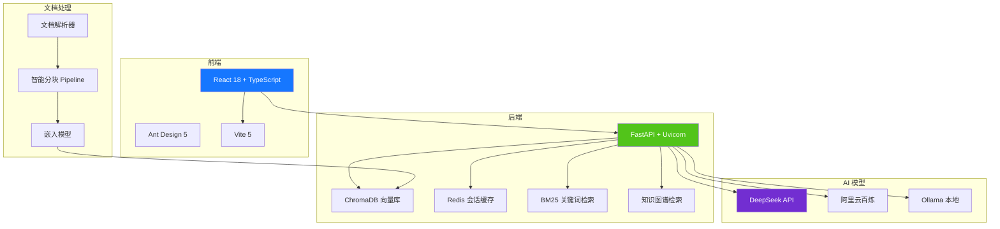
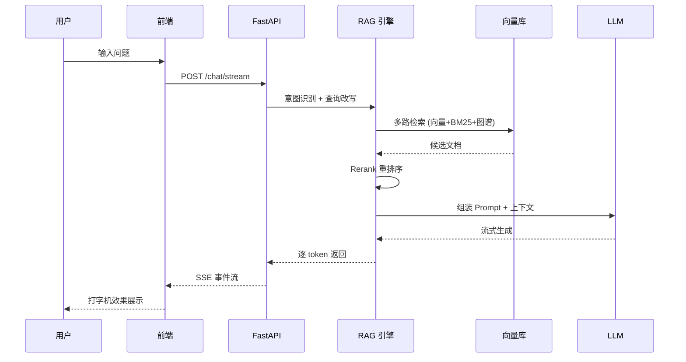

# KnowledgeMind 智知 — 企业级 RAG 智能知识库系统

基于 **DeepSeek** 大模型的检索增强生成（RAG）系统，支持多格式文档上传、多路混合检索、流式对话、多轮会话记忆，帮助企业快速构建私域知识库。

---

## 项目背景

企业内部沉淀了大量文档（产品手册、制度文件、会议纪要、技术文档等），传统基于关键词的全文搜索难以精准获取所需知识。KnowledgeMind 通过 **RAG（检索增强生成）** 技术，将企业文档向量化存储，结合 LLM 的语义理解与生成能力，实现"问即所得"的智能知识问答。

---

## 核心特性

| 特性 | 说明 |
|------|------|
| **多格式文档解析** | 支持 12 种格式：PDF / Word / Excel / PPT / Markdown / TXT / CSV；含 5 类图片 OCR / Vision（PNG / JPG / JPEG / BMP / GIF），扫描件 PDF 自动走 OCR |
| **多路混合检索** | 向量检索（ChromaDB）+ 关键词检索（BM25）+ 知识图谱检索 |
| **智能重排序** | 三级 Rerank 策略（L1/L2/L3），根据查询复杂度自适应调整 |
| **流式对话** | SSE 流式输出，打字机效果，用户体验流畅 |
| **多轮会话记忆** | 基于 Redis 的会话持久化，支持上下文连续对话 |
| **多模型支持** | DeepSeek / 阿里云百炼 / Ollama 本地模型，一键切换 |
| **置信度评估** | 自动评估回答可信度，透明展示知识来源 |
| **引用追溯** | 每条回答精确标注引用片段，支持原文查看 |
| **Docker 一键部署** | 前后端 + Redis 容器化，`docker-compose up` 即用 |

---

## 技术架构



### 检索流程



---

## 技术栈

| 层级 | 技术 | 选型理由 |
|------|------|----------|
| **前端框架** | React 18 + TypeScript | 类型安全、生态丰富、企业级首选 |
| **UI 组件库** | Ant Design 5 | 开箱即用的企业级组件 |
| **构建工具** | Vite 5 | 极快的 HMR 和构建速度 |
| **后端框架** | FastAPI | 高性能异步、自动 API 文档、Pydantic 校验 |
| **向量数据库** | ChromaDB | 轻量嵌入、零配置、适合中小规模 |
| **缓存** | Redis 7 | 会话持久化、L2 缓存 |
| **LLM 提供商** | DeepSeek API | 高性价比、中文能力强 |
| **嵌入模型** | BGE-small-zh-v1.5 | 中文语义匹配 SOTA |
| **容器化** | Docker + docker-compose | 一键部署、环境隔离 |

---

## 快速开始

### 前置要求

- Python 3.10+
- Node.js 18+
- Redis 7+（可选，用于会话持久化）
- DeepSeek API Key（或 Ollama 本地模型）

### 1. 克隆项目

```bash
git clone https://github.com/tuanzi188/KnowledgeMind.git
cd KnowledgeMind
```

### 2. 配置环境变量

```bash
cp backend/.env.example backend/.env
# 编辑 backend/.env，填入 DS_API_KEY
```

### 3. Docker 一键启动（推荐）

```bash
docker compose up -d --build
# 网页：http://localhost:5173
# API 文档：http://localhost:8002/docs
```

### 4. 本地开发模式

**后端：**

```bash
cd backend
pip install -r requirements.txt
python -m uvicorn app.main:app --host 0.0.0.0 --port 8002 --reload
```

**前端：**

```bash
cd frontend
npm ci
npm run dev
# 访问 http://localhost:5173
```

---

## 项目结构

```
KnowledgeMind/
├── frontend/                # React 前端
│   ├── src/
│   │   ├── api/             # API 客户端 & 类型定义
│   │   ├── components/      # 组件
│   │   │   ├── ChatBox.tsx          # 聊天主组件
│   │   │   ├── MessageItem.tsx      # 消息气泡
│   │   │   ├── ChatSidebar.tsx      # 侧边栏
│   │   │   ├── ChatHeader.tsx       # 顶部栏
│   │   │   ├── ChatInput.tsx        # 输入框
│   │   │   ├── CitationPanel.tsx    # 引用面板
│   │   │   ├── DocumentUpload.tsx   # 文档上传
│   │   │   └── DocumentManager.tsx  # 文档管理
│   │   ├── hooks/           # 自定义 Hooks
│   │   │   ├── useChat.ts           # 聊天逻辑
│   │   │   └── useConversations.ts  # 会话管理
│   │   ├── styles/          # 全局样式
│   │   ├── App.tsx
│   │   └── main.tsx
│   ├── package.json
│   └── vite.config.ts
├── backend/                 # FastAPI 后端
│   ├── app/
│   │   ├── api/             # API 路由
│   │   ├── core/            # 认证、安全
│   │   ├── models/          # 数据模型
│   │   ├── services/        # 核心服务
│   │   │   ├── rag_engine.py        # RAG 引擎
│   │   │   ├── hybrid_search.py     # 混合检索
│   │   │   ├── vector_store.py      # 向量存储
│   │   │   ├── reranker.py          # 重排序
│   │   │   ├── model_provider.py    # 模型提供商
│   │   │   └── ...
│   │   └── config.py        # 配置管理
│   ├── requirements.txt
│   └── Dockerfile
├── docker-compose.yml
├── README.md
└── .gitignore
```

---

## API 文档

启动后端后访问 http://localhost:8002/docs 查看 Swagger 自动生成的 API 文档。

| 端点 | 方法 | 说明 |
|------|------|------|
| `/api/v1/chat` | POST | 同步对话 |
| `/api/v1/chat/stream` | POST | 流式对话 (SSE) |
| `/api/v1/search` | POST | 语义搜索 |
| `/api/v1/upload` | POST | 上传文档 |
| `/api/v1/documents` | GET | 文档列表 |
| `/api/v1/documents/{id}` | DELETE | 删除文档 |
| `/api/v1/conversations` | GET | 会话列表 |
| `/api/v1/conversations/{id}` | GET | 会话详情 |
| `/api/v1/conversations/{id}` | DELETE | 删除会话 |
| `/api/v1/health` | GET | 健康检查 |
| `/api/v1/stats` | GET | 统计信息 |

---

## License

MIT

## 身份与权限

- 单用户开发模式：未配置认证时使用固定的 `anonymous` 身份，不读取客户端自报的用户、部门或角色。仅适合本机开发。
- 单用户访问控制：后端设置 `API_KEY`，在网页右上角账号面板输入该令牌。不要使用 `VITE_API_KEY` 将共享密钥编译进前端。
- 多用户模式：在 `backend/.env` 配置 `AUTH_USERS_JSON`，为每人提供独立随机令牌、用户 ID、角色与部门。配置示例见 `backend/.env.example`。启用后共享 `API_KEY` 不再有效。
- 用户 ID 应保持稳定；同一用户 ID 可配置多个令牌用于轮换。角色仅由服务端授予，只有管理员可查看全局分析与审计。
- 访问令牌只保存在当前标签页的会话存储中；退出后清除。部署到公网时必须使用 HTTPS，并设置身份凭据。
- 每个用户的会话使用独立存储命名空间，列表、详情、续聊、流式对话和删除均隔离。历史无身份会话仅在原单用户模式下可见，不自动分配给新用户。
- 本轮是访问凭据与会话隔离加固，不包含注册、找回密码、企业单点登录或用户管理后台。

## 数据与升级

- 本地默认写入仓库根目录 `data/`；Docker 使用 `DATA_DIR=/app/data`，与宿主机 `./data` 挂载一致，会话文件也使用这个目录。
- 旧版本曾将部分数据写到仓库父目录。升级前停止服务，备份旧目录，并手动迁移到新的 `data/`；不要直接覆盖已有数据。也可临时将 `DATA_DIR` 指向旧目录。
- Redis 仅在容器网络内使用，不再向宿主机公开 6379 端口。
- `frontend/index.html` 现在加载 React 入口，旧单文件界面保存在 `frontend/legacy-preview.html`，不参与生产构建。
- 无外部模型凭据时可以运行单元测试；实际文档问答仍需可用的模型 API 或本地 Ollama。

## 开发验证

```sh
cd backend
pip install -r requirements.txt
pip install pytest pytest-asyncio
python -m pytest -q
cd ../frontend
npm ci
npm test
npm run build
```

CI 同时运行后端测试、前端测试和生产构建。权限回归覆盖伪造角色、跨用户读取与删除、流式会话隔离和非法会话编号。
